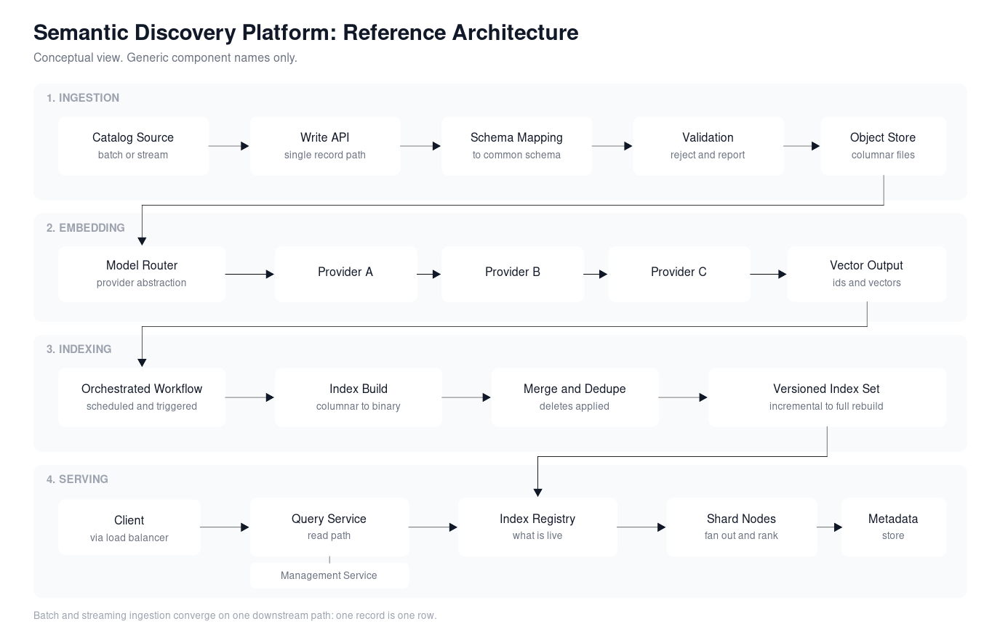

# Vantage Discovery: Product and AI Architecture Work

I led product and system architecture for a semantic product discovery platform built for retail and ecommerce catalogs. Shopify acquired the company in March 2025 for $59 million and folded the search platform into Shopify Search, Shop, and Storefront search ([Shopify's Q2 2025 filing](https://content-archive.fast-edgar.com/20250806/APB2H22CZ22YT2Z2222L22ZQAMKGWZ227272/R24.htm), [Business Insider](https://www.businessinsider.com/shopify-acquires-vantage-discovery-boost-ai-search-retailers-ecommerce-2025-3), [BetaKit](https://betakit.com/shopify-acquires-search-startup-vantage-discovery-for-undisclosed-amount/), [EMARKETER](https://www.emarketer.com/content/shopify-acquires-vantage-discovery-genai-search)).

This repository is a public summary of the role I played. It contains no source code, customer data, internal endpoints, or proprietary designs.

## What I owned

- Product definition for search and discovery: what a retailer could ask of their own catalog, and what the platform had to return to be worth switching for.
- Reference architecture across ingestion, embedding, indexing, and query serving, including the boundaries between services and who owned each contract.
- The build sequence: what shipped as a demo path, what became the first production path, and what became continuous.
- Cost and latency tradeoffs on embedding calls, index size, shard layout, and refresh cadence.
- Working sessions with engineering leads where the architecture actually got settled, then written down so it stayed settled.

## Architecture at a glance

Sanitized view. Generic component names, no customer detail, no internal service names.

## Architecture I designed and drove

Four layers, each with its own release path.

**Ingestion.** Customer catalogs arrive as raw or partly structured files. A preparation step maps customer schema to a common internal schema, validates it, and lands it in object storage as columnar files. I designed this to have three modes so the business was never blocked on one:

1. Manual notebook path for demos and early pilots.
2. Batch path with validation and embedding generation running as an orchestrated workflow.
3. Continuous path where single documents arrive through a write API, pass validation, flow through a queue, and get converted into the same columnar format as batch. One record is treated as one row, which kept batch and streaming on identical downstream code.

**Embedding.** A router sits in front of multiple embedding and language model providers instead of hardcoding one. Requests carry ids and text, responses carry ids and vectors. That indirection let us swap providers, run more than one model per collection, and negotiate on price without touching the indexing or serving layers.

**Indexing.** An orchestrated workflow converts columnar files with vectors into a binary index, then merges, dedupes, and applies deletes. Indexes are versioned by cadence, from incremental through hourly, daily, monthly, and full rebuild, so a collection can be reconstructed to a point in time. An index manager tracks what is live, publishes availability, and a downloader pulls current shards to the serving tier.

**Serving.** A load balancer fronts two public surfaces: a query API through a search broker, and a management API for collection lifecycle. Shard managers hold the loaded indexes. Metadata and collection state live in Postgres. The broker fans out across shards, merges, and ranks.

## Decisions worth calling out

- Same downstream path for batch and streaming. One row is one document, so continuous ingestion did not fork the codebase.
- Provider abstraction at the embedding layer, decided before the first production customer, which later saved a full rewrite when model choices changed.
- Cadence-based index versioning instead of one mutable index, which made deletes, backfills, and rollbacks routine rather than incidents.
- Polling on new files first, with a queue notification path designed in but deferred. Simple path shipped, upgrade path left open.
- Separate query and management APIs, so customer-facing read traffic and administrative writes could scale and fail independently.

## What I bring to a team

- I can hold the product argument and the system argument in the same conversation, then write down a design that engineering will actually build.
- I sequence architecture so revenue is not waiting on the ideal version.
- I make provider, cost, and latency tradeoffs explicit early, in writing, with the reasoning attached.
- I run the whiteboard sessions where these decisions get made, and I own the artifacts afterward.

## Contact

GitHub: [ali8gates](https://github.com/ali8gates)
